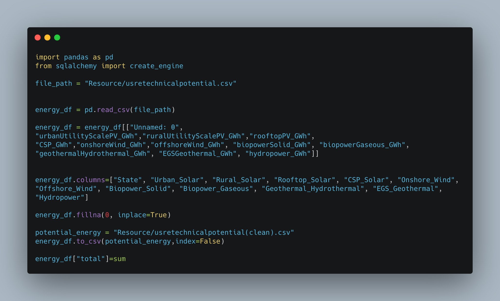
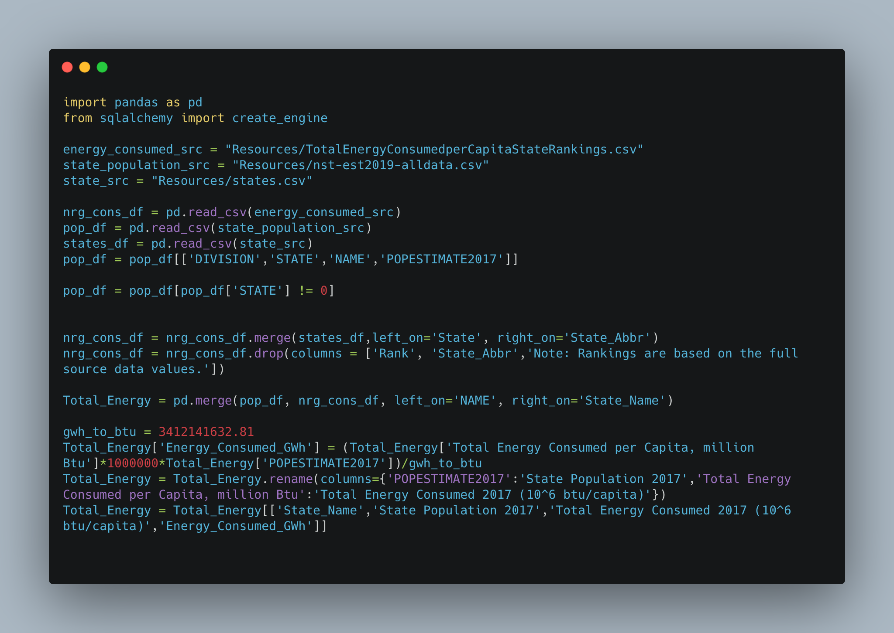
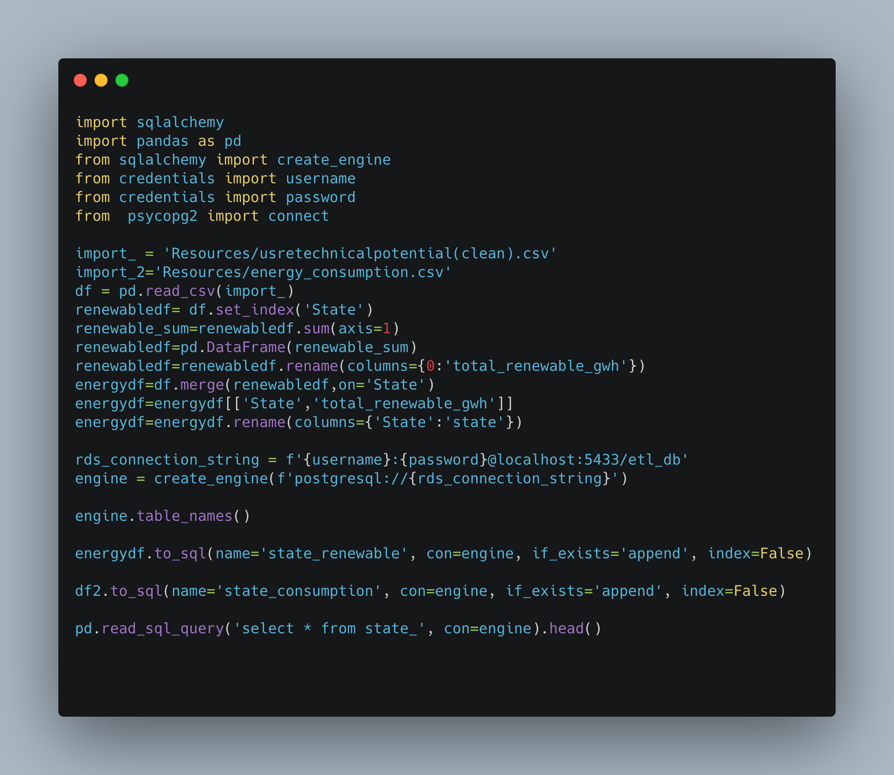
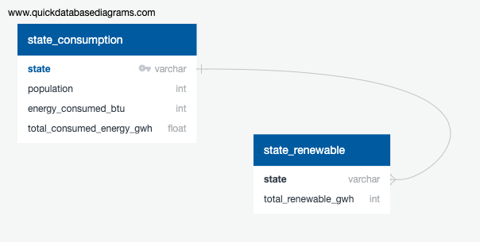
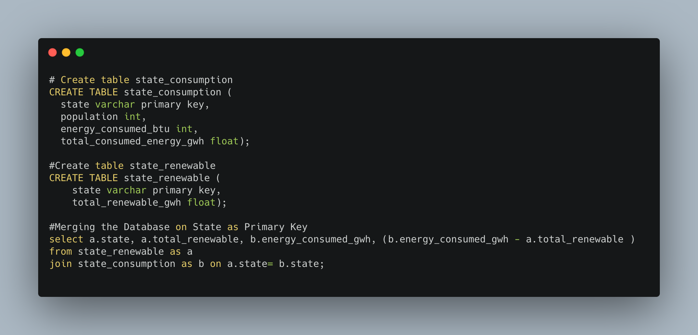

## ETL Energy Consumption

The purpose of this project is to merge datasets, transform, and load the energy consumption data from multiple sources and merge them as part of the ETL project. The United States consumes a lot of energy and it comes from multiple sources. Renewable energy is important because it limits the fuel amount used regularly which causes stress on the environment. For this project, data was extracted from a series of CSV files. 

## Code Walkthrough

 - Retrieved the data from the website United States Renewable Energy and downloaded it as a CSV file.
 - Then cleaned the data and created new dataframe.

 - Our first steps in cleaning up the datasets which variables were not relevant. The last step was to transfer our final output into a Database. We created a database and respective tables to match the columns from the final Panda’s Data Frame using MySQL and then connected to the database using SQLAlchemy and loaded the result.

 - Merged the CSV files.
 - Created the database in SQL using PGadming
 - Then Appened to the database using the SQLAlchemy within Jupyter notebook.

##To Create the Database in MySQL

##The link to the CSVs

- Source 1 (https://www.eia.gov/state/rankings/) is the energy rankings of states.
- Source 2 (https://data.world/doe/united-states-renewable-energy) lists the different renewable sources of energy.
- Source 3 (http://www2.census.gov/programs-surveys/popest/datasets/2010-2019/national/totals/nst-est2019-alldata.csv?# ) is a table of states and population.
